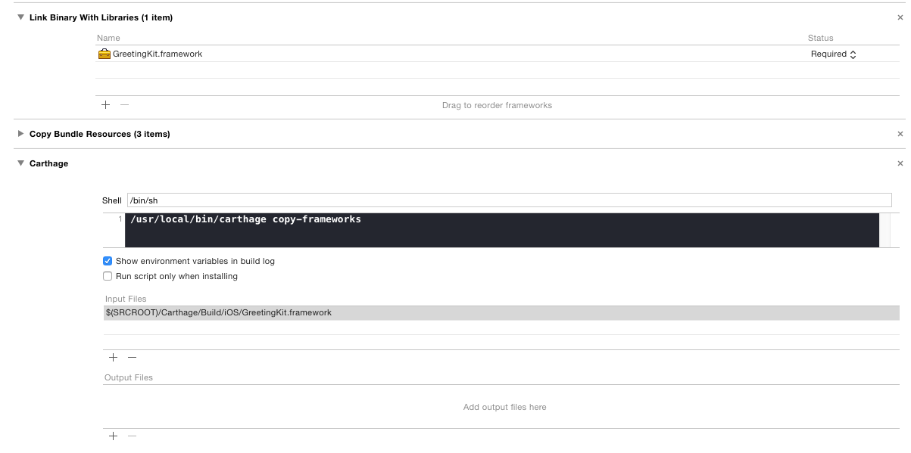
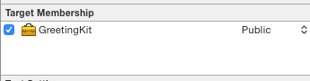

# GreetingKit

It is example project to test Carthage & Cocoa touch framework which uses swift, c and c++ files at the same time.

```swift
import UIKit
import GreetingKit

Hello("Hello")

HelloC("HaHaHaHa")

HelloCppWrapper.HelloCpp("Nice to meet you")
```

## Carthage




## Cocoa Touch Framework

You should header file's Target memberships as Public.


